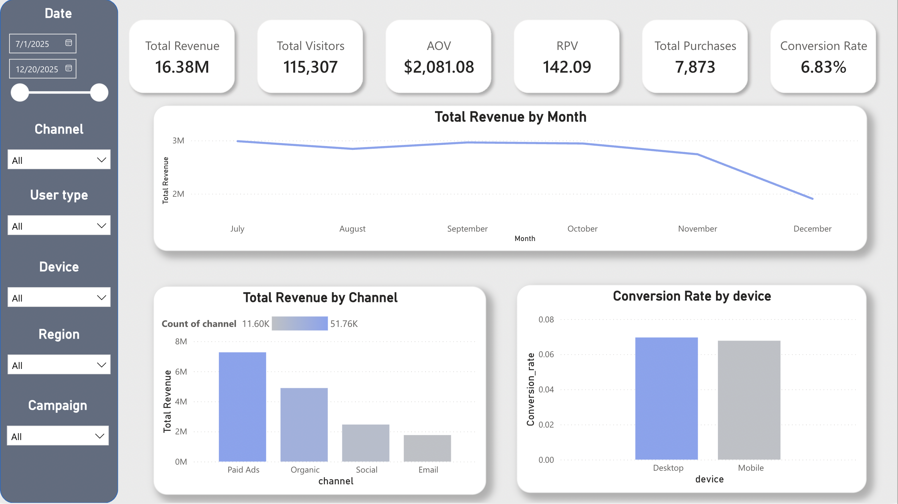
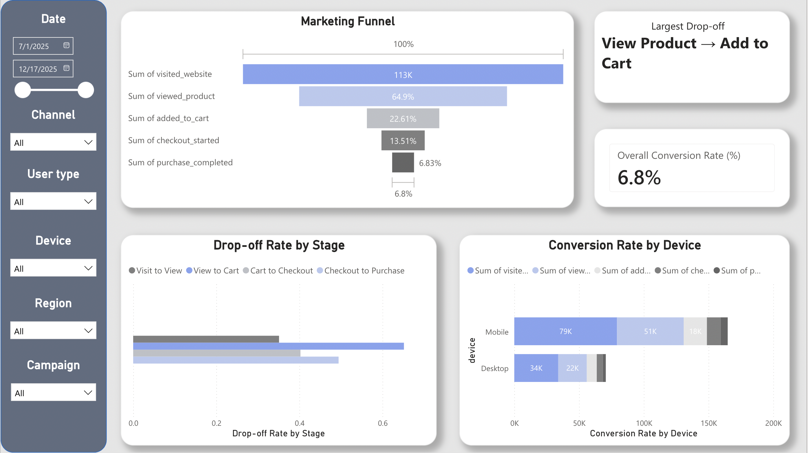
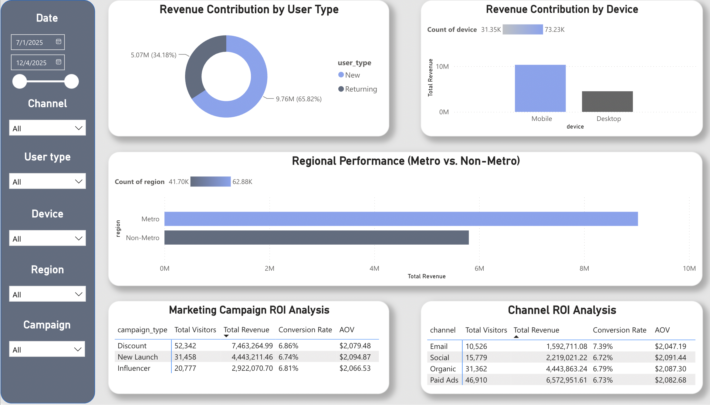

# Optimizing E-Commerce Marketing Funnel Performance

An end-to-end data analytics project that evaluates e-commerce marketing performance, identifies customer conversion bottlenecks, and provides data-driven business recommendations using Python, SQL, and Power BI.

---

## Summary

This project analyzes an e-commerce marketing funnel dataset containing over 120,000 customer interaction records. The objective is to evaluate overall business performance, identify key conversion bottlenecks, compare marketing channel effectiveness, and generate actionable recommendations for improving marketing ROI and customer conversion.

The project follows a complete analytics workflow including SQL data extraction, Python-based data cleaning and exploratory analysis, statistical testing, and interactive dashboard development in Power BI.

---

## Skills Applied

- Data Cleaning & Data Validation
- Exploratory Data Analysis (EDA)
- Feature Engineering
- SQL Querying & Data Aggregation
- Statistical Analysis & Hypothesis Testing
- Business Intelligence Dashboard Design
- Data Storytelling & Business Recommendation

---

## Features

- Cleaned and transformed raw marketing funnel data using Python (Pandas)
- Performed SQL aggregation and business metric analysis using SQLite
- Conducted exploratory data analysis and statistical validation
- Built an interactive three-page Power BI dashboard
- Identified customer conversion bottlenecks and high-performing marketing channels
- Generated data-driven business recommendations

---

## Tech Stack

**Programming Language**
- Python

**Database**
- SQLite

**Visualization**
- Power BI

**Libraries**
- Pandas
- NumPy
- Matplotlib
- SciPy
- Statsmodels

**Tools**
- Jupyter Notebook

---

## Demo

### Executive Dashboard



### Marketing Funnel Analysis



### Customer & Marketing Insights



---

## Background and Problem

Many e-commerce businesses invest heavily in marketing but lack visibility into where customers abandon the purchasing journey and which marketing channels deliver the greatest business value.

This project aims to answer the following business questions:

- How is the business performing overall?
- Where do customers drop off in the marketing funnel?
- Which marketing channels perform best?
- Which customer segments contribute the most revenue?
- What business actions should be prioritized?

---

## Project Workflow

Raw Data

↓

SQL (SQLite)

↓

Python Data Cleaning

↓

EDA & Statistical Analysis

↓

Power BI Dashboard

↓

Business Insights & Recommendations

---


## How to Run

```bash
git clone https://github.com/jiajialiang32-ui/E-Commerce-Marketing-Funnel-Analytics.git

cd E-Commerce-Marketing-Funnel-Analytics

pip install -r requirements.txt

jupyter notebook notebooks/marketing_funnel_analysis.ipynb
```

